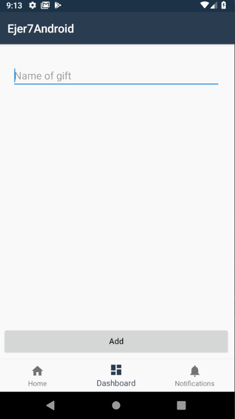

# Ejer7 ChristmasExercise

Con una aplicación de tres pestañas. Tenemos dos listados, uno con los regalos creados y otro con notificaciones. Se debe arrancar la aplicación en la pestaña central, mostrando un pequeño formulario que nos permita guardar elementos en el listado.

Se debe crear un evento en las notificaciones cada vez que se produzca un evento. (Se crea un regalo, se marca el checkbox, etc)

**Los datos deben quedar almacenados para que al arrancar de nuevo la aplicación se recarguen**

**Tener en cuenta los espaciados de los diferentes elementos, además del diseño**
